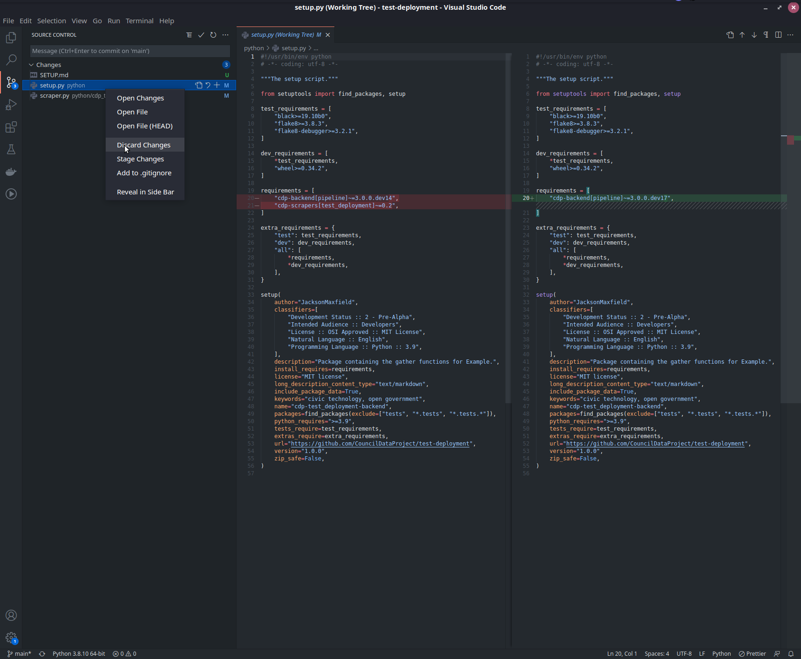

# Updating to New Cookiecutter Releases

As we have abstracted away the `cdp-backend` for pipeline, infrastructure,
and, database functionality, and `cdp-frontend` for web-app functionality,
and because every time the pipelines which utilize those packages run, the
pipeline pulls in the latest (non-breaking) versions of each, you should
rarely need to update anything yourself.

However, in the instance that a new version of
_this cookiecutter generated repository_ becomes available
(as seen on our [releases page](https://github.com/CouncilDataProject/cookiecutter-cdp-deployment/releases)),
you may want to pull in the changes as they might change default pipeline configuration,
enable new features, add more documentation, and more.

To do so, you should feel comfortable with the command line and git.

### Steps to Upgrade

1. Clone (or fetch and pull) your repository:

    - `git clone https://github.com/sunshine-request/cdp-asheville.git`

    OR if you have previously cloned your repository and other changes have occurred:

    - `git checkout main`
    - `git fetch`
    - `git pull main`

2. Install `cookiecutter`:

    You will need Python 3.6+ installed for this.

    - `pip install cookiecutter`

3. Update your repo using the latest cookiecutter version:

    This will pull in the current cookiecutter updates as changes to the current
    repository.

    Ensure you are in the repository directory:

    - `cd asheville`

    Then run:

    - `just update-from-cookiecutter`

    **Note: you may need to install [just](https://github.com/casey/just#packages).**

4. Select the desired changes to commit:

    In an editor or in the terminal you can now review the changes to commit.

    With git in a terminal:

    - `git status`
    - `git add {some-file}`
    - OR `git restore {some-file}`

    

    In VS Code:

    

5. Commit and push:

    With the desired changes selected, commit and push to update your repository.
    It is recommended to include the cookiecutter version in your commit message.

    - `git commit -m "Update to cookiecutter v0.1.0"`
    - `git push origin main`

After all steps are complete, you should see updates on your repository and
any pipelines that run on `push` they will automatically trigger.
